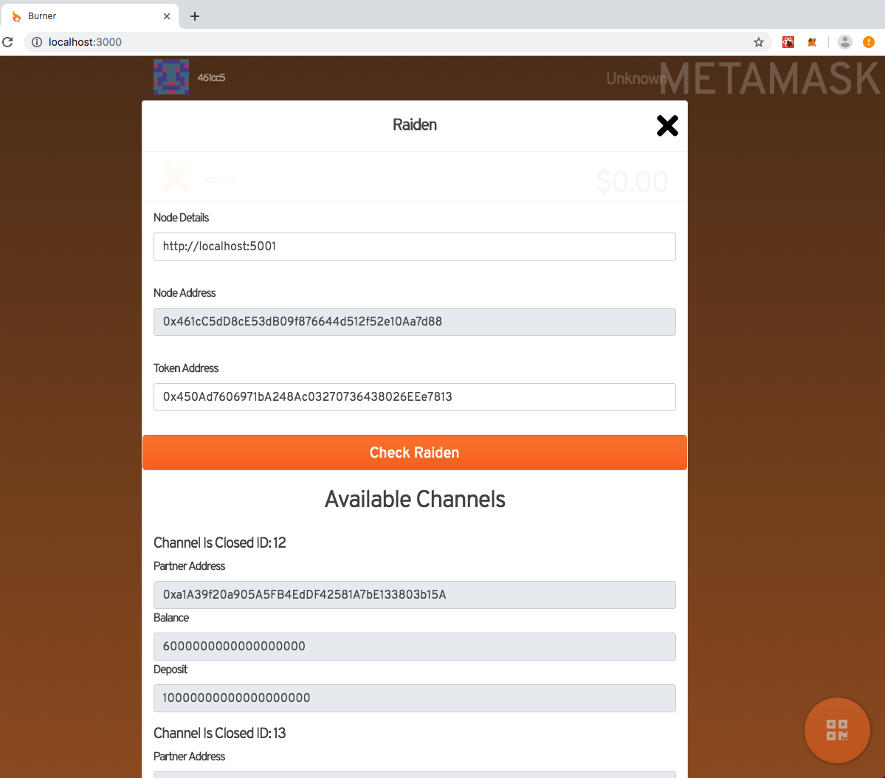

### Raiden Burner - Beyond blockchain virtual hackathon entry


[Demo Video](http://www.youtube.com/watch?v=Pn0gsljGalo)

The aim of my entry was to add an easy to use Raiden payment option to the [Burner Wallet](https://github.com/austintgriffith/burner-wallet), a really user friendly web wallet. Raiden aims to make payments for dApps easy by enabling fast and cheap off-chain transfers so I can imagine loads of times it could be useful in a Burner project.
The Burner Wallet Collective was formed with the aim of making the Burner Wallet cleaner and more extensible and I thought it would be really cool if there was an easy way to drop in a component that extends the Burner and allows a user to get up and running with Raiden easily.



There's still a bunch to build on but the functionality in the demo demonstrate nicely that this can work. Some to dos:

* Would like to pull out Raiden functions to a helper library.
* Doesn't make use of any Raiden events yet.
* Better error handling.
* UI/UX can always be improved.
* Really looking forward to a Raiden Light Client, for now everything is running by connecting to a local node.

### To Run

It's the same as getting the Burner Wallet up and running so follow instructions below. Then you'll need to run some Raiden Nodes locally and connect to them (see guide below for more detail).

assuming you have [nodejs](https://nodejs.org/en/download/) and [git](https://git-scm.com/downloads) already installed...

you'll need ganache installed and running
```
npm install -g ganache-cli
ganache-cli
```

clone the burner wallet repo
```
git clone https://github.com/austintgriffith/burner-wallet.git
cd burner-wallet
```

initialize burner:
```
npx clevis init
```
(You'll need to hit enter a few times to specify some config directories.)

install burner:
```
npm i
```

link clevis
```
alias clevis='./node_modules/clevis/bin.js'
```

compile, deploy, test, and inject all contracts in the frontend:
```
clevis test full
```

start the app:
```
npm run start-local
```

OR start the app on the xDai chain:
```
npm start
```


### Idiots Guide

I spent a fair bit of time understanding what is going on, what the setup should look like and getting various things up and running. I thought it might be useful to detail out what I did as a kind of idiots guide that might help others in the future.

#### Overview
First of all it's good to know a rough overview of how alls this works. First you need a Raiden Node (I think node is the correct terminology, that's what I'm going to use anyway :) ) running locally. This is a stand alone binary that connects to an Ethereum Node (more later) and handles all things related to payments, channels, etc. The Raiden Node is associated with an Ethereum address loaded during init from a local keystore file. In the future there will be a light client but for now everything is done via the main Raiden Node. As a developer you then write an application that interacts with the Raiden Node via an API. Raiden deals with ERC20 tokens only and you need to know the address of any token you want to use. Useful to know - you can run many independent Raiden Nodes on your local machine, you just have to change the port it runs on. So it kind of looks like this:

                              Eth Keystore --- Raiden ---- Ethereum Network ---- Your Token
                                                 \
                                                  \
                                                  Application

#### Ethereum Node & Keystore

Easiest and quickest way to generate Ethereum addresses in a keystore format is to use Geth:
* [Geth download](https://geth.ethereum.org/downloads/)
* `geth account new` generates a new account and it shows you the path of the keystore


It was recommended to use the Goerli Ethereum testnet. Some useful info:
* [Goerli Info](https://github.com/goerli/testnet)
* Whatever address you use needs some test Eth to run Raiden so get from the faucet
* [Goerli Faucet](https://goerli-faucet.slock.it/)

You can connect to a local Ethereum Node but I didn't have one sync'd so I went with the RPC method, see below.

#### Raiden Setup  

I initially tried brew to install as per the [online instructions](https://raiden-network.readthedocs.io/en/latest/overview_and_guide.html) but it didn't work so I'd recommend going with a download from [here](https://github.com/raiden-network/raiden/releases). You can now run Raiden. I used the following command:

`./raiden --keystore-path  keystore --eth-rpc-endpoint 'https://rpc.slock.it/goerli' --environment-type development --network-id goerli --api-address 127.0.0.1:5002`

So you have to change:
* keystore - to match the path of your local Keystore
* eth-rpc-endpoint - I used RPC because I didn't have a local client and it worked every time for me
* api-address - Change 5002 which is the port number if you want to run more than one Raiden node on same machine

Now you should have a Raiden node up and running and can access it on the handy Raiden UI at http://127.0.0.1:5001/ui/home.

In terms of interaction there is the [Web UI tutorial](https://raiden-network.readthedocs.io/en/latest/webui_tutorial.html) but the most useful thing I found to work through was the [API walkthrough](https://raiden-network.readthedocs.io/en/latest/api_walkthrough.html). I wrote a bunch of node scripts to test the API and they can be found in /tests/raidenScripts.js.

This tech is cool so go have some fun!
